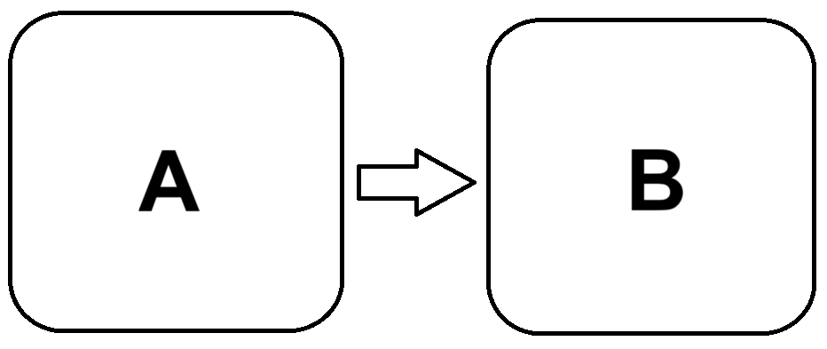
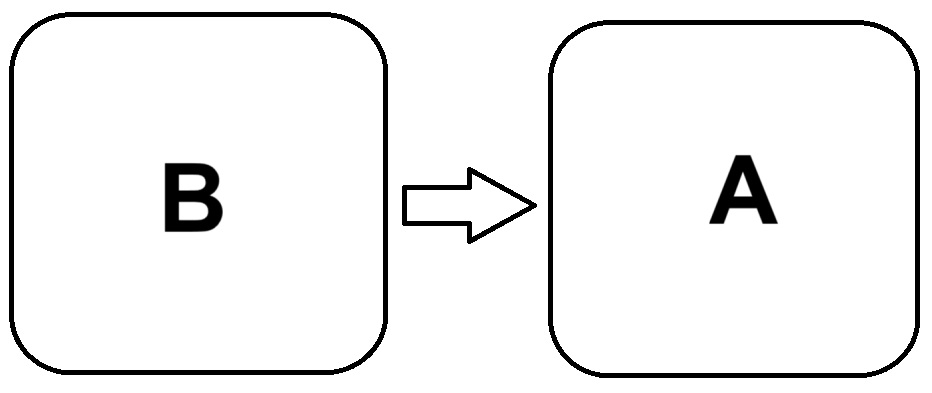
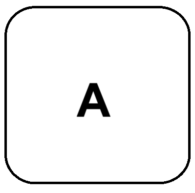
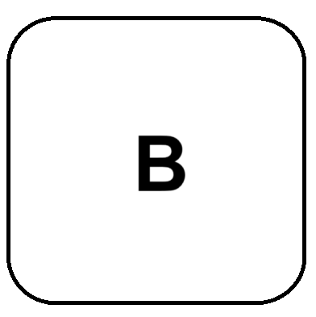

# CC du 24 Mars 2023

```c
typedef struct SingleLinkedListElem {
    int data;   // Donnée enregistrée dans le maillon de liste
    SingleLinkedListElem* next; // Pointeur vers l'élément suivant dans la liste
} SingleLinkedListElem;

typedef struct SingleLinkedList {
    int size;   // Taille de la liste (nb d'éléments dedans)
    SingleLinkedListElem* head; // Premier élément de liste (tête)
    SingleLinkedListElem* tail; // Dernier élément de liste (queue)
} SingleLinkedList;
```

## I - Tableau

Consigne : **Donnez de manière exhaustive, l'ensemble des conditions d'erreur détectables à l'entrée de la fonction et qui feront qu'on va la quitter sans chercher à poursuivre le traitement**

Conditions d'erreur :

| Description           | Code C        |
| --------------------- | ------------- |
| La liste n'existe pas | `Liste == NULL` |
| La liste est vide | `Liste->size <= 0` |
| La liste n'a pas de tête | `Liste->head == NULL` |
| La liste n'a pas de queue | `Liste->tail == NULL` |
| L'élément A n'existe pas | `elementA == NULL` |
| L'élément B n'existe pas | `elementB == NULL` |

## II - Schémas

Consigne : **Décrivez l'ensemble des configurations de chaînage possibles qui font intervenir les deux maillons**

Bon là le sujet est pas clair, donc je vais partir du principe qu'on veut les différentes positions pour lesquelles il y a uniquement A et/ou B dans la liste. Si c'est pas ça, bah ratio le sujet

- Position 1 :
  
  - A en tête, précédant B
  - B en queue, suivant A
- Position 2 :
  
  - A en queue, suivant B
  - B en tête, précédant A
- Position 3 :
  
  - A en tête et en queue
  - B pas dans la liste
- Position 4 :
  
  - A pas dans la liste
  - B en tête et en queue

## III - Code

Consigne : **Donnez le code C d'une partie de la fonction qui permet de permuter les maillons A et B lorsqu'ils se trouvent dans cette configuration de chaînage**

Y'a plusieurs moyens de faire ça, le plus simple et rapide c'est juste d'inverser les données contenues dans les noeuds (remerciez Adam pour la technique, j'y aurai pas pensé tout seul)

```c
int tmp = elementA->data;
elementA->data = elementB->data;
elementB->data = tmp;
```

Sinon, on peut aussi parcourir la liste jusqu'à trouver l'élément juste avant A, puis l'utiliser pour permuter A et B :

```c
SingleLinkedListElem* beforeA = list->head;
while(beforeA->next != elementA) beforeA = beforeA->next;
SingleLinkedListElem* beforeB = elementA->next;

// On modifie les éléments suivants des éléments précédant A et B
beforeA->next = elementB;
beforeB->next = elementA;

// On inverse les éléments suivants de A et B
SingleLinkedListElem* tmp = elementA->next;
elementA->next = elementB->next;
elementB->next = tmp;
```
