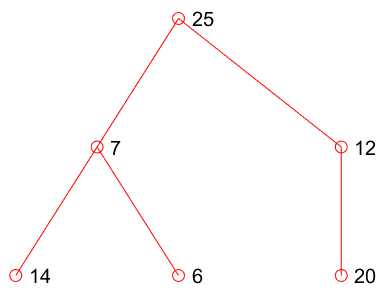

# Contrôle Continu d'Algorithmique - 3 Mars 2023

## Partie I

### I - Question 1

Tableau originel :

| Indice | 0   | 1   | 2   | 3   | 4   | 5   |
| ------ | --- | --- | --- | --- | --- | --- |
| Valeur | 25  | 7   | 12  | 14  | 6   | 20  |

Représentation sous forme d'arbre :



### I - Question 2

| Permutations | 0   | 1   | 2   | 3   | 4   | 5   |
| ------------ | --- | --- | --- | --- | --- | --- |
| 0 (initial)  | 25  | 7   | 12  | 14  | 6   | 20  |
| 1            | 25  | 14  | 12  | 7   | 6   | 20  |
| 2            | 25  | 14  | 20  | 7   | 6   | 12  |
| 3            | 12  | 14  | 20  | 7   | 6   | 25  |
| 4            | 20  | 14  | 12  | 7   | 6   | 25  |
| 5            | 6   | 14  | 12  | 7   | 20  | 25  |
| 6            | 14  | 6   | 12  | 7   | 20  | 25  |
| 7            | 14  | 7   | 12  | 6   | 20  | 25  |
| 8            | 6   | 7   | 12  | 14  | 20  | 25  |
| 9            | 12  | 7   | 6   | 14  | 20  | 25  |
| 10           | 6   | 7   | 12  | 14  | 20  | 25  |
| 11           | 7   | 6   | 12  | 14  | 20  | 25  |
| 12 (final)   | 6   | 7   | 12  | 14  | 20  | 25  |

Il y a en tout eu `12` permutations

## Partie II

### II - Question 1

```c
typedef struct {
    float typeVal;
    int stackNbElements;
    int coinsMaxNb;
    float tab[MAXSIZE];
} MoneyStack;
```

### II - Question 2

```c
float rendreLaMonnaie(float sommeDue, float sommePayee){
    int i = 0;
    while(sommePayee > 0 && i < machine1.nBStack){
        // Si on a encore assez de monnaie pour mettre dans cette pile, et qu'elle n'est pas remplie
        if(machine1.tab[i]->typeVal >= sommePayee){
            // Alors on ajoute la monnaie dans la pile
            pushMoney(machine1.tab[i], machine1.tab[i]->typeVal);
            // Et on l'enlève à la somme payée
            sommePayee -= machine1.tab[i]->typeVal;
        }
        // Sinon, on change de pile
        else i++;
    }
    while(sommeDue > 0){

    }
    if(sommeDue > 0) return change;
}
```
