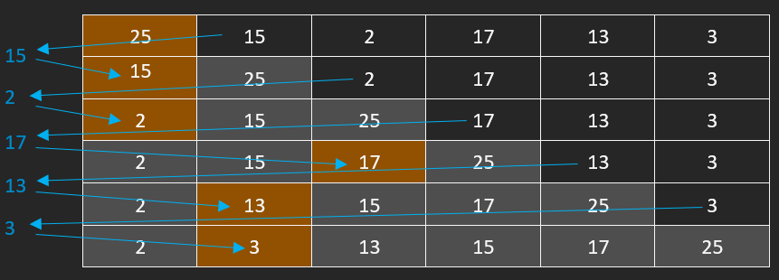
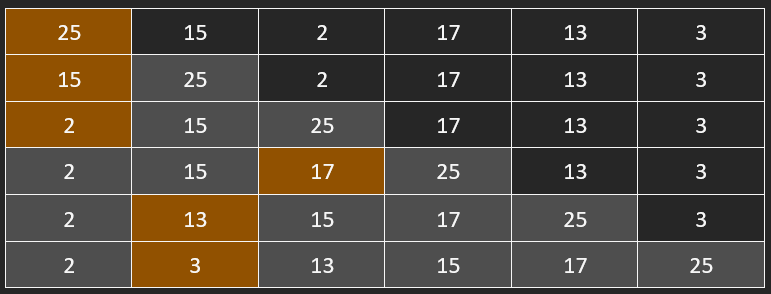

# DS de Programmation du 16 Février 2024

## Exercice 1

```c
int rang(int* tab, int iStart, int iEnd, int val){
    // Si iEnd == iStart + 1, alors le sous-tableau entre iStart et iEnd
    // ne contient que 2 éléments. La position cherchée est la position de
    // l'un de ces éléments
    if(iEnd == iStart + 1) {

        // Si l'élément d'index `iStart` est >= `val`, alors il est l'élément du
        // tableau directement supérieur à `val`, et `iStart` est l'indice cherché
        if(*(tab + iStart) >= val) return iStart;
        
        // Sinon, l'élément directement supérieur est celui d'index `iEnd`.
        // On renvoie donc cette valeur
        else return iEnd;
    }

    // Calcule l'indice de moitié du tableau
    int iMid = (iStart + iEnd) / 2;

    // Si la valeur à l'indice `iMid` vaut `val`, alors on peut renvoyer
    // `iMid` directement. Instruction non nécessaire, permet juste de
    // speed up un peu le processus dans certains cas
    if(*(tab + iMid) == val) return iMid;


    // `tab[iMid]` < `val` --> la valeur doit se placer dans le tableau à droite de iMid
    // Donc dans le tableau de iMid à iEnd. On va donc chercher cette valeur avec un appel récursif
    if(*(tab + iMid) < val) return rang(tab, iMid, iEnd, val);
    
    // Sinon, alors la valeur doit se placer à gauche de `iMid`, donc dans le tableau entre
    // `iStart` et `iMid`. On va donc la chercher avec un appel récursif
    return rang(tab, iStart, iMid, val);
}
```

## Exercice 2

Code :

```c
int sort_insert(int* tab, int tabsize){
    if(tab == NULL || tabsize < 0) return EXIT_FAILURE;

    for(int i = 1; i < tabsize; i++){
        if(*(tab + i - 1) > *(tab + i)){
            int val = *(tab + i),
                j   = i - 1;
            for(j; *(tab + j) > val && j > 1; j--) *(tab + j + 1) = *(tab + j);
            *(tab + j) = val;
        }
    }
}
```

Tableau :



Sans les flèches :


