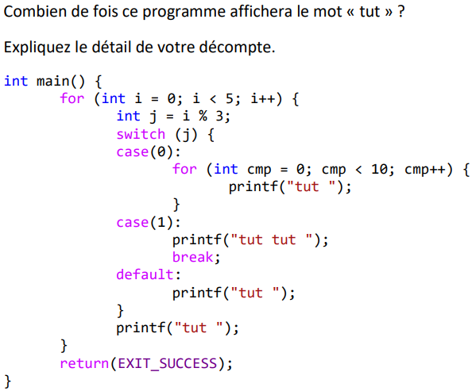
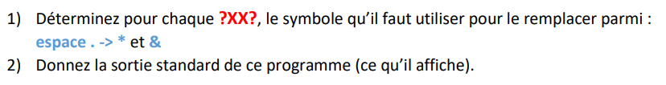
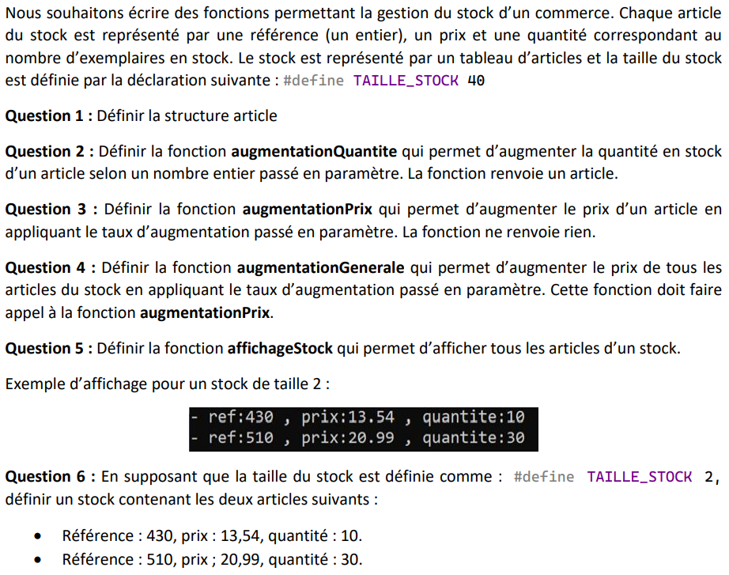
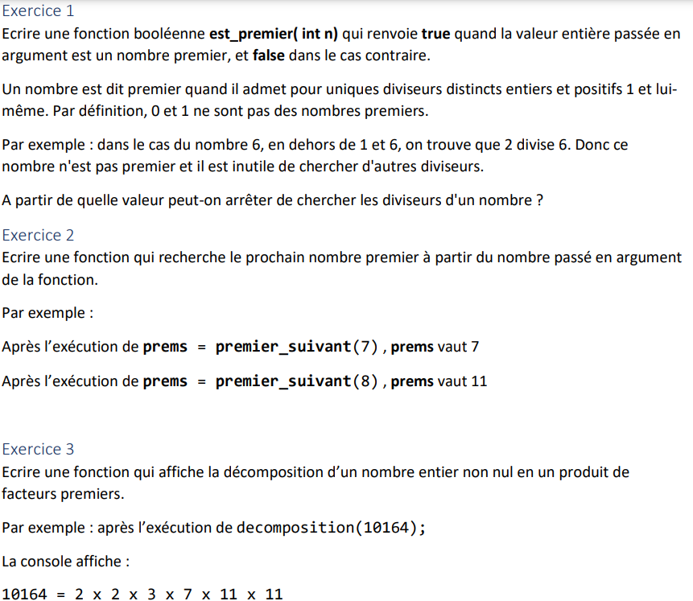

# Partiel d'Algorithmique - 6 janvier 2022

## Partie I

### Exercice 1

Enoncé :



L'opérateur modulo (`a % b`) renvoie le reste de la division euclidienne de `a` par `b`

Première itération, `i = 0`, `j = 0 % 3 = 0` :

- Switch case `0` : on imprime `10` fois tut
- Pas de break -> on passe au case `1` : on imprime encore `2` fois tut (total `12`)
- Break -> on sort du switch
- On imprime une fois de plus tut : total = `13`

Seconde itération, `i = 1`, `j = 1 % 3 = 1` :

- Switch case `1` : 2 fois tut, total = `15`
- Break -> on sort du switch
- On imprime une fois de plus tut : total = `16`

Troisième itération, `i = 2`, `j = 2 % 3 = 0` :

- Switch case `default` : 1 fois tut, total = `17`
- On imprime une fois de plus tut : total = `18`

Quatrième itération, `i = 3`, `j = 3 % 3 = 0` :

- Switch case `0` : on imprime `10` fois tut, total = `28`
- Pas de break -> on passe au case `1` : on imprime encore `2` fois tut (total `30`)
- Break -> on sort du switch
- On imprime une fois de plus tut : total = `31`

Cinquième itération, `i = 4`, `j = 4 % 3 = 1` :

- Switch case `1` : 2 fois tut, total = `33`
- Break -> on sort du switch
- On imprime une fois de plus tut : total = `34`

Total final : `34`

### Exercice 2

Enoncé :



> Rappel : `.` permet d'accéder à un élément d'une structure donnée directement, `->` permet d'accéder à un élément d'une structure dont on a le pointeur : `pointeur->valeur` est la même chose que `(*pointeur).valeur`
> 
> En admettant que `pointeur` pointe vers `objet`, les 3 instructions suivantes sont équivalentes :

```c
objet.valeur
pointeur->valeur
(*pointeur).valeur
```

#### Question 1

1) `.`
2) `.`
3) `.`
4) `.`
5) `.`
6) `.`
7) `->`
8) `->`
9) `->`
10) `*`
11) `&`
12) `->`
13) `->`
14) vide
15) vide
16) `&`
17) `*`

Code final si vous voulez tester :

```c
typedef struct de {
    int nbFace; // nombre de faces du dé
    int faceSelect; // face active du dé (entre 1 et nbFace inclus)
    char id[8]; // identifiant du dé
}dice;

// renvoie 0 si la face sélectionnée n'est pas une face possible pour ce dé
int verifie(dice d) {
    int valide = 0;
    if (d.faceSelect <= d.nbFace && d.faceSelect > 0) {
        valide = 1;
    }
    return valide;
}

// affiche les caractéristiques du dé à l'écran
void affiche(dice d) {
    printf("Le dé %s de %d faces est actuellement sur la face %d.\n",
        d.id, d.nbFace, d.faceSelect);
}

// lance un dé : modifie la face sélectionnée
void tirage(dice* d) {
    printf("On lance le dé %s\n", d->id);
    d->faceSelect = (1 + rand() % d->nbFace);
    affiche(*d);
}

int main() {
    dice D20 = { 20,25,"d20" };
    dice* copie = &D20;
    copie->id[3] = 'z';
    copie->id[5] = 't';
    affiche(D20);
    if (verifie(D20)) { printf("Ce dé est valide.\n"); }
    else { printf("Ce dé n'est pas valide.\n"); }
    tirage(&D20);
    affiche(*copie);
}
```

#### Question 2

Sortie :

```console
Le dé d20z de 20 faces est actuellement sur la face 25.
Ce dé n'est pas valide.
On lance le dé d20z
Le dé d20z de 20 faces est actuellement sur la face 2.
Le dé d20z de 20 faces est actuellement sur la face 2.
```

## Partie II

Enoncé :



```c
#include <stdlib.h>
#include <stdio.h>

#define TAILLE_STOCK 2

/* Question 1 : Structure */
typedef struct art {
    int ref;
    float prix;
    int quantite;
} article;

/* Question 2 : augmentationQuantite */
article augmentationQuantite(article * art, int augmentation) {
    art->quantite += augmentation;
    return *art;
}

/* Question 3 : augmentationPrix */
void augmentationPrix(article* art, float taux) {
    art->prix += (art->prix * taux);
    return;
}

/* Question 4 : augmentationGenerale */
void augmentationGenerale(article* stock, float taux) {
    for (int i = 0; i < TAILLE_STOCK; i++) augmentationPrix(stock + i, taux);
    return;
}

/* Question 5 : affichageStock */
void affichageStock(article* stock) {
    for (int i = 0; i < TAILLE_STOCK; i++) printf_s("- ref:%d , prix:%.2f , quantite:%d\n", (stock + i)->ref, (stock + i)->prix, (stock + i)->quantite);
    return;
}

int main() {
    /* Question 6 : Définition du stock*/
    article stock[TAILLE_STOCK] = {
        {430, 13.54, 10},
        {510, 20.99, 30}
    };

    affichageStock(stock);
    return(EXIT_SUCCESS);
}
```

## Partie III

Enoncé :



### Exercice 1

```c
int est_premier(int n) {
    for (int i = 2; i < sqrt(n) + 1; i++) {
        /* Si i divise n, alors n n'est pas premier et on retourne faux */
        if (n % i == 0) return 0;
    }
    /* Sinon n est premier et on retourne vrai */
    return 1;
}
```

La limite à partir de laquelle on peut arrêter de chercher est l'entier directement supérieur à la racine carrée de n

### Exercice 2

```c
int premier_suivant(int n) {
    int i = 0;
    /* On augmente i jusqu'à trouver un nombre qui soit premier */
    while (!est_premier(n + i)) {
        i++;
    }
    return n + i;
}
```

### Exercice 3

```c
void decomposition(int n) {
    /* Plus petit terme premier diviseur de n. Pour chercher les facteurs premier de n, on divise d'abord par 2, puis 3, etc. C'est pareil pour petit_terme, il commence à 2 puis augmente dès qu'il n'est plus diviseur de n */
    int petit_terme = 2;
    printf_s("%d = ", n);
    while (!est_premier(n)) {
        /* Si petit_terme divise n, alors n est égal au quotient de la division, et on imprime un terme en plus */
        if (n % petit_terme == 0) {
            printf_s("%d x ", petit_terme);
            n /= petit_terme;
        }
        /* Sinon, petit_terme devient le facteur premier suivant (excluant lui-même, d'où le +1)*/
        else petit_terme = premier_suivant(petit_terme + 1);
    }
    printf_s(" %d\n", n);
}
```
