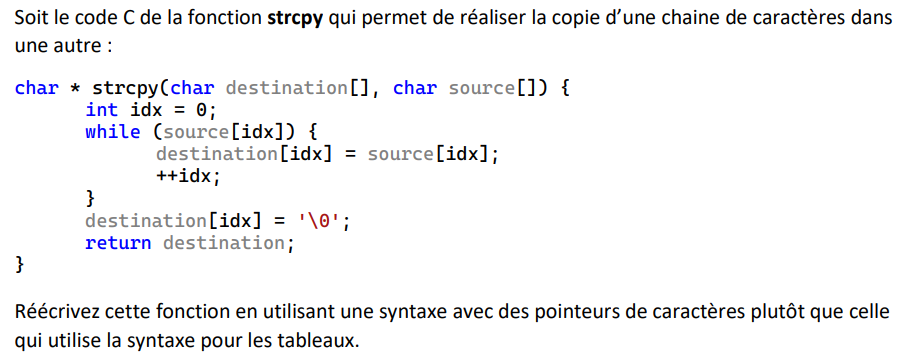
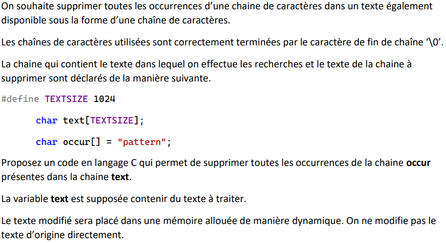
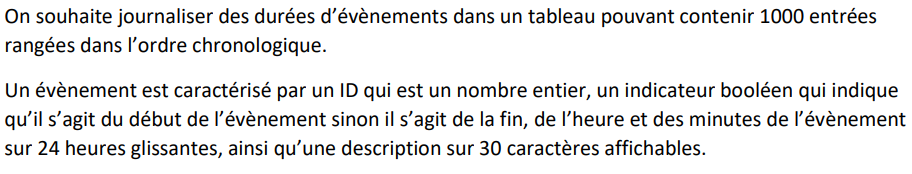

# Partiel d'Algorithmique - 4 janvier 2023

Correction du Partiel d'Algorithmique de C du 4 janvier 2021

Ecrit par Léo Lewandowski

## Exercice I

Énoncé :



> Pour cet exercice, il est important de se rappeler que les tableaux sont des pointeurs, et de l'équivalence suivante :
>
> `tab[i] == *(tab + i)`

Corrigé :

```c
char * strcpyPtr(char * destination, char * source) {
    int idx = 0;
    while( *(source + idx) ) {
        *(destination + idx) = *(source + idx);
        ++idx;
    }
    *(destination + idx) = '\0';
    return destination;
}
```

## Exercice II

Énoncé :



Code :

```c
#define TEXTSIZE 1024

/* Vérifie si le texte contient le pattern à partir de l'indice idx.
Si oui, alors renvoie l'indice de fin du pattern dans le texte,
sinon l'indice de départ de recherche donné */
int checkIndex(char text[], char occur[], int idx) {
    int i = 0;
    while (occur[i] && text[idx + i]) {
        char a = occur[i], b = text[idx + i];
        if (occur[i] != text[idx + i]) return idx;
        ++i;
    }
    return idx + i;
}

/* Renvoie une chaîne de caractères égale à text,
en enlevant toutes les itérations de occur */
char* removePattern(char text[], char occur[]) {
    // Nouveau texte
    char* newText = calloc(TEXTSIZE, sizeof(char));
    if(newText == NULL || text == NULL || occur == NULL) return NULL;
    // Variable d'indice de text, variable de test de position, variable d'indice de newText
    int src = 0, j = 0, size = 0;
    while (text[src]) {
        j = checkIndex(text, occur, src);
        // Si j == src, alors le prochain caractère est valide, on l'ajoute au tableau
        if (j == src) {
            *(newText + size) = text[src];
            src++;
            size++;
        }
        // Si j et src sont différents, alors ça veut dire que le pattern se trouve direct après.
        // On saute donc le pattern en passant directement à j, et on n'ajoute aucune lettre
        else src = j;
    }
    return newText;
}
```

## Exercice III



### Question 1

Énoncé : Donnez une implémentation en C de la structure event.

```c
struct event {
    int id;
    int heure;
    int minute;
    bool debut;
    char description[31];
}
```

> Pour la taille de la description, on met 31 car il faut 30 caractères affichables + 1 caractère de fin de chaîne non affiché

### Question 2

Énoncé : Quelle taille fait votre structure en octets ?

La taille d'une structure est la somme des tailles de tous les éléments de la structure, lesquels sont :

- 3 `int`, de `2` octets chacun ce qui fait `6` octets
- 1 `bool`, de `1` octet
- 31 `char`, de `1` octet chacun, ce qui fait `31` octets

Additionnés ensemble, cela nous donne `38` octets de mémoire en tout

> Parfois les `int` sont encodés sur `4` bits et non `2`, si vous voulez être sûrs d'avoir les points précisez bien la taille des `int` que vous prenez en compte

### Question 3

Énoncé : Donnez la déclaration du type Event basé sur la structure event

```c
typedef struct event Event;
```

> En C, on fait un typedef avec la syntaxe suivante : `typedef typeDeBase nouveauType;`
>
> Ici, `typeDeBase` est `struct event`, et le `nouveauType` est `Event`;

### Question 4

Énoncé :  Ecrivez le code C de la fonction reportCurrent qui prend en argument un journal
d’évènements, le nombre d’évènements dans le journal et affiche, pour tous les évènements
__*non terminés*__, leur ID, leur heure de début et leur description.

```c
void reportCurrent(Event journal[], int nbEvenements) {
    printf("Journal des évènements :\n");
    for(int i = 0; i < nbEvenements; i++) {
        bool fini = false;

        // On parcours le tableau jusqu'à trouver la date de fin de l'évènement
        for(int j = 0; j < nbEvenements && !fini; i++){
            // Si les deux évènements ont le même ID, alors ce sont les mêmes. On vérifie si cet évènement est fini
            if(journal[j].id == journal[i].id && !journal[j].debut) fini = true;
        }

        // Si l'évènement n'est pas terminé, on l'affiche
        if(!fini){
            printf("----------------------\nID: %d, Début: %dh%d\nDescription :\n  %s\n\n",
                journal[i].id, journal[i].heure, journal[i].minute, journal[i].description);
        }
    }
}
```
