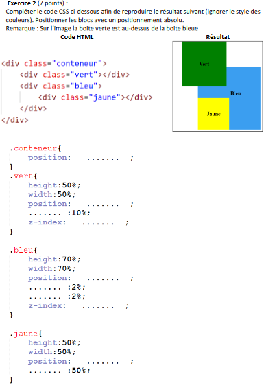
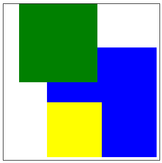
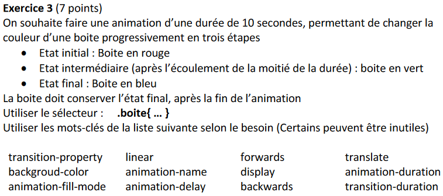
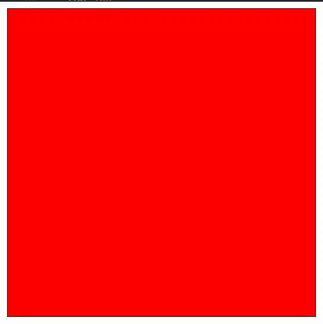
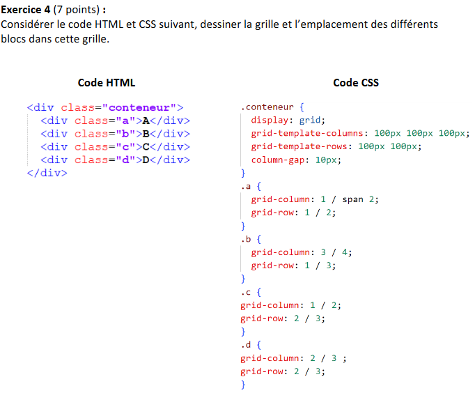
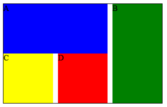
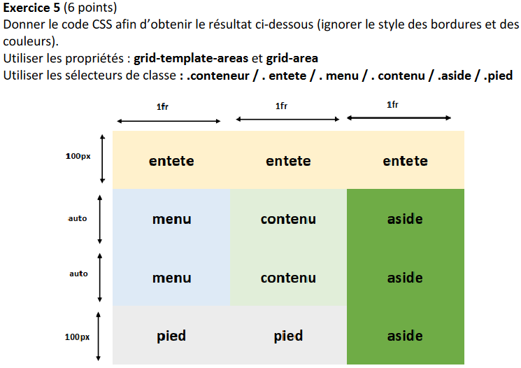
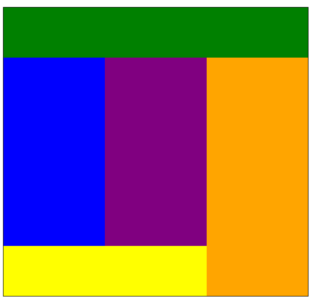
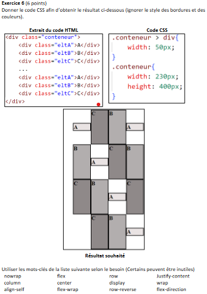
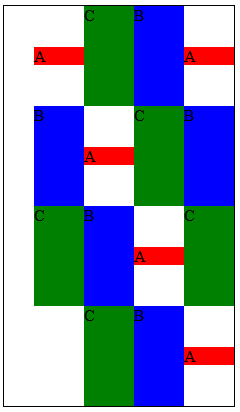

# DS De Web - Novembre 2022

Voici une correction de l'annale de CC Web Novembre 2022, pour ceux qui veulent s'entraîner.

J'ai mis des exemples ainsi que les énoncés pour chaque exercice

J'ai fait aussi [un JsFiddle](https://jsfiddle.net/pexgn0uL/138/) pour que vous puissiez voir comment marche le code

## Exercice 1 - QCM

PDF donné par RedBear [dans le salon prog](https://discord.com/channels/1112777726999400458/1134859634503594145/1183802275479683173)

## Exercice 2

Énoncé :



Code :

```html
<div class="conteneur">
    <div class="vert"></div>
    <div class="bleu">
        <div class="jaune"></div>
    </div>  
</div>
```

```css
.conteneur {
    position:absolute;
}

.vert {
    height:50%;
    width:50%;
    position:absolute;
    left:10%;
    z-index:2;
}

.bleu {
    height:70%;
    width:70%;
    position: absolute;
    bottom:2%;
    right:2%;
    z-index:-1;
}

.jaune {
    height:50%;
    width:50%;
    position:absolute;
    top:50%;
}
```

Résultat :



## Exercice 3

Énoncé :



Code :

```css
.boite {
    animation-name: color-shift;
    animation-fill-mode: forwards;
    animation-duration: 10s;
}

@keyframes color-shift {
    0% {
        background-color: red;
    }
    50% {
        background-color: green;
    }
    100% {
        background-color: blue;
    }
}
```

Résultat : (Le cube reste bleu à la fin, c'est juste le gif qui se répète)



## Exercice 4

Énoncé :



Code de l'énoncé :

```html
<div class="conteneur">
    <div class="a">A</div>
    <div class="b">B</div>
    <div class="c">C</div>
    <div class="d">D</div>
</div>
```

```css
.conteneur {
    display: grid;
    grid-template-columns: 100px 100px 100px;
    grid-template-rows: 100px 100px;
    column-gap: 10px;
}

.a {
    grid-column: 1 / span 2;
    grid-row: 1 / 2;
}

.b {
    grid-column: 3 / 4;
    grid-row: 1 / 3;
}

.c {
    grid-column: 1 / 2;
    grid-row: 2 / 3;
}

.d {
    grid-column: 2 / 3;
    grid-row: 2 / 3;
}
```

Résultat (à dessiner) :



## Exercice 5

Note : On peut aussi utiliser seulement des `divs` à la place des différents éléments HTML, cela importe peu

Énoncé :



Code :

```html
<div class="conteneur">
    <header class="entete"></header>
    <nav class="menu"></nav>
    <div class="contenu"></div>
    <aside class="aside"></aside>
    <footer class="pied"></footer>
</div>
```

```css
.conteneur {
    grid-template-columns: repeat(3,1fr);
    grid-template-rows: 100px auto auto 100px;
    grid-template-areas:    "entete entete entete"
                            "menu contenu aside"
                            "menu contenu aside"
                            "pied pied aside"
}

.entete {
    grid-area:entete;
}

.menu {
    grid-area:menu;
}

.contenu {
    grid-area:contenu;
}

.aside {
    grid-area:aside;
}

.pied {
    grid-area:pied;
}
```

Résultat :



- Header : vert
- Menu : bleu
- Contenu : violet
- Aside : orange
- Pied : jaune

## Exercice 6

Énoncé :



Code :

```html
<div class="conteneur">
    <div class="eltA">A</div>
    <div class="eltB">B</div>
    <div class="eltC">C</div>
    ...
    <div class="eltA">A</div>
    <div class="eltB">B</div>
    <div class="eltC">C</div>
</div>
```

```css
.conteneur > div {
    width:50px;
    height:100px;
}

.conteneur {
    width:230px;
    height:400px;
    display:flex;
    flex-direction:row-reverse;
    flex-wrap:wrap;
    justify-content:end;
}

.eltA {
    align-self:center;
}

.eltB, .eltC {
    align-self:stretch;
}
```

Résultat :


